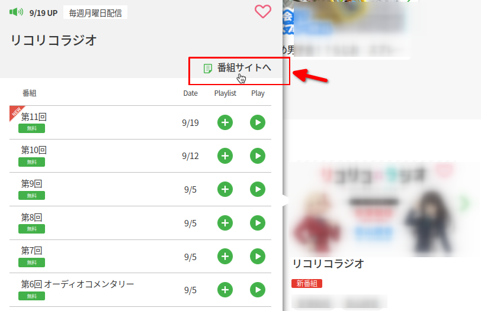
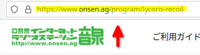

# OnsenDL

audio download tool for [onsen](https://www.onsen.ag) listener

## :wrench: Try

Before you do, you must setup uv.
The instruction can be found [here](https://docs.astral.sh/uv/getting-started/installation/).

```plain
git clone https://github.com/h-takeyeah/onsendl.git
cd onsendl
# run
uv run onsendl https://www.onsen.ag/program/<title>
```

- **ffmpeg** is required

## :runner: Usage

1. Go to [onsen.ag](onsen.ag)
2. Search favorite program and click *to program site*<div></div>
3. Copy URL of the opened tab<div></div>
4. Pass URL to onsendl
5. All episodes will be downloaded to current directory

```plain
usage: __main__.py [-h] program_url

positional arguments:
  program_url  url of onsen.ag radio program

options:
  -h, --help   show this help message and exit
```

## :dart: TODO

- sequential play without downloading
- build

## Escape clause

I can't take responsibility or liability for any consequences resulting from use of this software.
